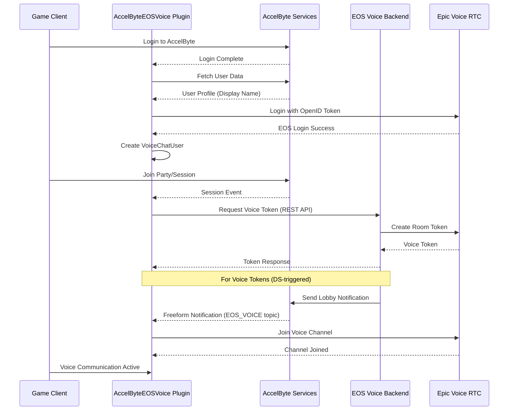

# AccelByteEOSVoice

AccelByteEOSVoice is an Unreal Engine plugin that bridges AccelByte Gaming Services (AGS) identity and session management with Epic Online Services (EOS) voice chat. It automatically joins EOS voice channels for parties and sessions based on AccelByte events.

## Quick Start

1. Deploy the backend service: [extend-eos-voice-rtc](https://github.com/AccelByte/extend-eos-voice-rtc)
2. Install `AccelByteUe4SdkCustomization` generated from that service (see SDK Generation)
3. Enable required Unreal plugins (see Prerequisites)
4. Add these sections to `DefaultEngine.ini`:

```ini
[/Script/AccelByteUe4SdkCustomization.AccelByteCustomizationSettings]
EOSVoiceServerUrl=<EOS-Service-URL>

[/Script/OnlineSubsystemEOS.EOSSettings]
bUseEAS=false
bUseEOSConnect=true
bUseNewLoginFlow=true

[/Script/AccelByteEOSVoice.AccelByteEOSVoiceConfig]
bAutoJoinPartyVoice=true
bAutoJoinTeamVoice=false
bAutoJoinSessionVoice=false
bServerAutoGenerateTeamVoiceToken=false
bServerAutoGenerateSessionVoiceToken=false
bAutoGenerateDisplayNameIfEmpty=false
```

5. Launch the game and log in to AccelByte. The plugin will log in to EOS and join voice channels based on your config.

## Prerequisites

### Required Unreal Engine Plugins
- **AccelByteUe4SdkCustomization** - Voice Chat API SDK plugin generated using AccelByte Extend Codegen CLI
- **OnlineSubsystemAccelByte** - AccelByte identity and session management
- **AccelByteUe4Sdk** - AccelByte SDK (User API, Lobby API)
- **OnlineSubsystemEOS** - Epic Online Services integration
- **EOSVoiceChat** - EOS voice chat implementation
- **VoiceChat** - Unreal Engine voice interface

### Epic Developer Portal Setup

1. Enable these Epic services:
   - Epic Online Services (EOS)
   - RTC Voice
   - EOS Connect (for OpenID authentication)

2. Configure EOS Connect with AccelByte OpenID:

   - **Identity Provider**: OpenID
   - **Description**: AccelByte
   - **Type**: UserInfo Endpoint
   - **UserInfo API Endpoint**: `https://{your-ags-domain}/iam/v3/public/users/me`
   - **HTTP Method**: GET
   - **AccountId Mapping**: `userId`
   - **DisplayName Mapping**: `displayName`

3. For dev/stage, add test accounts to an EOS Player Group with Identity Provider = OpenID.

## Setup Details

### SDK Generation

The **AccelByteUe4SdkCustomization** plugin must be generated from the deployed EOS Voice Extend Service using the AccelByte Extend Codegen CLI:

**Option 1: Generate the SDK yourself**
1. Follow the [Extend Codegen CLI documentation](https://docs.accelbyte.io/gaming-services/services/extend/service-extension/using-extend-codegen-cli-to-generate-unreal-sdk-plugin-for-extend-service-extension/) to generate the Unreal SDK plugin for the EOS Voice Extend Service
2. Place the generated `AccelByteUe4SdkCustomization` plugin in your project's `Plugins/` directory

**Option 2: Use pre-generated SDK**
- If you don't have other customization SDKs in your project, download a pre-generated version from the [AccelByteEOSVoice releases section](https://github.com/Accelbyte/accelbyte-eos-voice-unreal/releases)
- Extract the plugin to your project's `Plugins/` directory

> **Note**: The SDK must match the OpenAPI specification of your deployed EOS Voice Extend Service. Regenerate the SDK if you update the backend service with API changes.

### Backend Service Deployment

This plugin requires the **AccelByte EOS Voice Extend Service** to be deployed as an Extend Service Extension:
- Repository: https://github.com/AccelByte/extend-eos-voice-rtc
- Purpose: Generates Epic voice tokens and manages room lifecycle

### Dedicated Server Permissions

If you plan to use **server-initiated voice token generation** (dedicated server auto-generates tokens for all players), the dedicated server's OAuth client requires:

- For AGS Private Cloud:
  - `ADMIN:NAMESPACE:{namespace}:VOICE [CREATE]`
  - `ADMIN:NAMESPACE:{namespace}:NOTIFICATION [CREATE]`

> **Warning**: Admin endpoints require AGS Private Cloud. Custom permissions are not supported in Shared Cloud, so admin endpoints will return `403 Permission Denied` in Shared Cloud environments.

Without these permissions, use client-initiated token requests (`bAutoJoinTeamVoice` / `bAutoJoinSessionVoice`).

## Configuration

### AccelByte Customization Settings (DefaultEngine.ini)

Set the EOS Voice backend base URL used by the generated customization SDK:

```ini
[/Script/AccelByteUe4SdkCustomization.AccelByteCustomizationSettings]
EOSVoiceServerUrl=<EOS-Service-URL>
```

### EOS Configuration (DefaultEngine.ini)

Enable EOS Connect and disable EAS to use OpenID authentication:

```ini
[/Script/OnlineSubsystemEOS.EOSSettings]
bUseEAS=false
bUseEOSConnect=true
bUseNewLoginFlow=true
```

### Plugin Configuration (DefaultEngine.ini)

```ini
[/Script/AccelByteEOSVoice.AccelByteEOSVoiceConfig]
; Auto-join party voice when creating/joining a party
bAutoJoinPartyVoice=true

; Auto-join team voice when joining a game session
bAutoJoinTeamVoice=false

; Auto-join session-wide voice when joining a game session
bAutoJoinSessionVoice=false

; (Dedicated Server) Auto-generate team voice tokens for all players via admin endpoint
bServerAutoGenerateTeamVoiceToken=false

; (Dedicated Server) Auto-generate session voice tokens for all players via admin endpoint
bServerAutoGenerateSessionVoiceToken=false

; Auto-generate display names for users without one (format: Player-XXXX)
bAutoGenerateDisplayNameIfEmpty=false
```

### Channel Types & Room IDs

| Channel Type | EOS Channel Name | Room ID Pattern | Example Room ID |
|--------------|------------------|-----------------|-----------------|
| `PARTY` | `"PARTY"` | `{party_id}:Voice` | `abc123:Voice` |
| `TEAM` | `"TEAM"` | `{session_id}:{team_id}` | `match-456:blue-team` |
| `SESSION` | `"SESSION"` | `{session_id}:Voice` | `match-456:Voice` |

Use `UAccelByteEOSVoiceSubsystem::ToChannelName()` to convert enum to channel string.

## Voice Chat Features

The plugin supports three types of voice channels:

### Party Voice
- **Channel**: `PARTY`
- **Scope**: All members in the same AccelByte party
- **Auto-Join**: Controlled by `bAutoJoinPartyVoice` (default: `true`)

### Team Voice
- **Channel**: `TEAM`
- **Scope**: Players on the same team within a game session
- **Auto-Join**: Controlled by `bAutoJoinTeamVoice` (default: `false`)

### Session Voice
- **Channel**: `SESSION`
- **Scope**: All players in the game session (across all teams)
- **Auto-Join**: Controlled by `bAutoJoinSessionVoice` (default: `false`)

All channels use non-positional (2D) audio and are managed automatically based on session lifecycle.

## Usage Examples

### Get the Voice Subsystem

```cpp
// From Game Instance
UGameInstance* GameInstance = GetWorld()->GetGameInstance();
UAccelByteEOSVoiceSubsystem* VoiceSubsystem = GameInstance->GetSubsystem<UAccelByteEOSVoiceSubsystem>();
```

### Mute/Unmute Microphone

```cpp
// Mute your microphone
VoiceSubsystem->SetAudioInputDeviceMuted(true);

// Unmute your microphone
VoiceSubsystem->SetAudioInputDeviceMuted(false);
```

### Mute/Unmute Speakers

```cpp
// Deafen (mute all incoming voice)
VoiceSubsystem->SetAudioOutputDeviceMuted(true);

// Undeafen
VoiceSubsystem->SetAudioOutputDeviceMuted(false);
```

### Mute Specific Player

```cpp
// Mute a specific player by their player name
VoiceSubsystem->SetPlayerMuted(TEXT("PlayerName123"), true);

// Unmute
VoiceSubsystem->SetPlayerMuted(TEXT("PlayerName123"), false);
```

### Switch Transmit Channel

```cpp
// Transmit to party channel only
VoiceSubsystem->TransmitToSpecificChannel(EAccelByteEOSVoiceVoiceEOSTokenResponseChannelType::PARTY);

// Transmit to team channel only
VoiceSubsystem->TransmitToSpecificChannel(EAccelByteEOSVoiceVoiceEOSTokenResponseChannelType::TEAM);

// Transmit to session channel only
VoiceSubsystem->TransmitToSpecificChannel(EAccelByteEOSVoiceVoiceEOSTokenResponseChannelType::SESSION);
```

### Access Advanced EOS Voice Features

```cpp
// Get the raw IVoiceChatUser for advanced functionality
IVoiceChatUser* VoiceChatUser = VoiceSubsystem->GetVoiceChatUser();

if (VoiceChatUser)
{
    // Get list of players in current channels
    TArray<FString> Players = VoiceChatUser->GetPlayersInChannel(TEXT("PARTY"));

    // Get all joined channels
    TArray<FString> Channels = VoiceChatUser->GetChannels();

    // Check if transmitting
    bool bIsTransmitting = VoiceChatUser->IsTransmitting();
}
```

## Public API Reference

### UAccelByteEOSVoiceSubsystem

| Method | Description | Parameters |
|--------|-------------|------------|
| `LoginToEpic()` | Manually trigger EOS login (usually automatic) | `int32 LocalUserNum` |
| `SetPlayerMuted()` | Mute/unmute a specific player | `FString PlayerName, bool bIsMuted` |
| `SetAudioInputDeviceMuted()` | Mute/unmute microphone | `bool bIsMuted` |
| `SetAudioOutputDeviceMuted()` | Mute/unmute speakers (deafen) | `bool bIsMuted` |
| `TransmitToSpecificChannel()` | Set which channel to transmit voice to | `EAccelByteEOSVoiceVoiceEOSTokenResponseChannelType` |
| `GetVoiceChatUser()` | Get raw EOS voice chat interface | Returns `IVoiceChatUser*` |
| `ToChannelName()` | Convert channel type enum to string | Static function, returns `FString` |

## Architecture & Runtime Flow



### Key Components

**UAccelByteEOSVoiceSubsystem** (GameInstanceSubsystem)
- Main orchestrator for voice functionality
- Handles AccelByte and EOS login flows
- Manages voice channel lifecycle
- Listens for session events and lobby notifications
- Provides public API for voice control

**Integration with Backend Service**
- Plugin calls the [extend-eos-voice-rtc](https://github.com/AccelByte/extend-eos-voice-rtc) backend service to generate voice tokens
- Two token delivery methods:
  - **Direct Response**: Client requests token via REST API and receives it immediately
  - **Lobby Notification**: Dedicated server requests tokens and sends notifications to players (topic: `EOS_VOICE`)

### Runtime Flow (High Level)

1. Player joins party/session
2. Plugin checks auto-join config flags
3. Plugin requests voice token (client) or receives notification (server)
4. Plugin joins EOS voice channel

## Troubleshooting

### EOS Login Fails

**Symptoms**: `Failed to login to EOS voice for LocalUserNum X`

**Checks**:
- EOS Connect OpenID provider is configured in Epic Developer Portal
- User has a display name (enable `bAutoGenerateDisplayNameIfEmpty` if needed)
- `bUseEOSConnect=true` and `bUseNewLoginFlow=true` in `DefaultEngine.ini`

### Voice Channels Not Joining

**Symptoms**: No voice token received, channels not joining

**Checks**:
- Backend service (extend-eos-voice-rtc) is deployed and reachable
- Auto-join config flags are enabled for the intended channel
- For server-initiated tokens: DS permissions are set and `notify=true` is used

### Lobby Notifications Not Received

**Symptoms**: Voice tokens not arriving when DS generates them

**Checks**:
- Dedicated server has `bServerAutoGenerateTeamVoiceToken` or `bServerAutoGenerateSessionVoiceToken` enabled
- DS OAuth client has `ADMIN:NAMESPACE:{namespace}:VOICE [CREATE]` and `ADMIN:NAMESPACE:{namespace}:NOTIFICATION [CREATE]` permissions (Private Cloud)
- Client is connected to AccelByte Lobby

## Key Files

- **Public/AccelByteEOSVoiceSubsystem.h** - Main subsystem interface and config class
- **Private/AccelByteEOSVoiceSubsystem.cpp** - Implementation of voice logic and flows

## Related Resources

- [AccelByte EOS Voice Backend Service](https://github.com/AccelByte/extend-eos-voice-rtc) - Required backend service
- [AccelByte Gaming Services Documentation](https://docs.accelbyte.io/) - AGS platform documentation
- [Epic Online Services RTC Documentation](https://dev.epicgames.com/docs/game-services/real-time-communication-interface/voice) - EOS voice features
- [EOS Connect Documentation](https://dev.epicgames.com/docs/game-services/connect) - OpenID integration guide

## Notes

- Voice tokens are generated by the backend service and can be delivered via direct API response or lobby notifications
- Lobby notifications are only sent when using admin endpoints with `notify=true` (typically from dedicated servers)
- The plugin automatically manages channel lifecycle - no manual join/leave required for configured channels
- Display name is required by EOS - enable auto-generation or ensure users have display names before login
- Channel room IDs are cached in `RoomIdMap` for proper cleanup when sessions end
