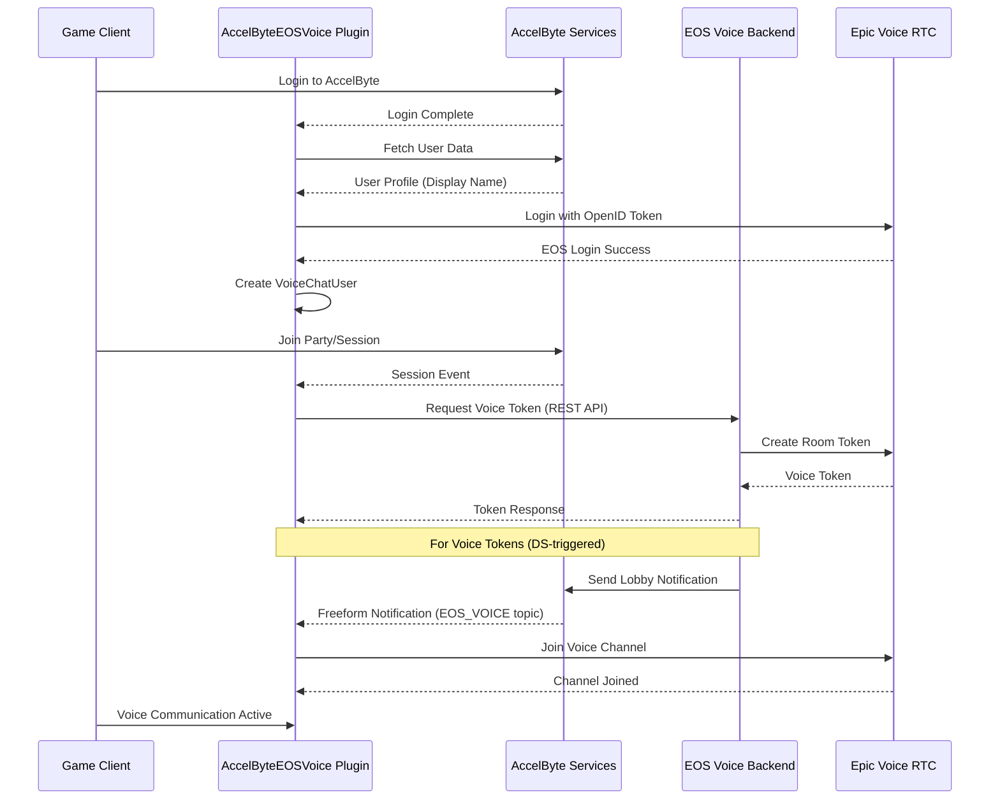

# AccelByteEOSVoice

AccelByteEOSVoice is an Unreal Engine plugin that bridges AccelByte Gaming Services (AGS) identity and session management with Epic Online Services (EOS) voice chat. It enables seamless voice communication in parties, teams, and game sessions by automatically managing EOS voice channels based on AccelByte session lifecycle events.

## What This Plugin Does

This plugin acts as the **client-side component** that works with the [AccelByte EOS Voice Extend Service](https://github.com/AccelByte/extend-eos-voice-rtc) to provide voice chat functionality. It:

- Authenticates users to EOS using AccelByte OpenID access tokens
- Automatically joins appropriate voice channels when players create/join parties or game sessions
- Requests voice tokens from the backend service and receives them via lobby notifications
- Manages voice channel lifecycle (join/leave) based on session state
- Provides a simple C++ API for controlling voice features (mute, transmit channel, etc.)


## Prerequisites

### Required Unreal Engine Plugins
- **AccelByteUe4SdkCustomization** - Voice Chat API SDK plugin generated using AccelByte Extend Codegen CLI
- **OnlineSubsystemAccelByte** - AccelByte identity and session management
- **AccelByteUe4Sdk** - AccelByte SDK (User API, Lobby API)
- **OnlineSubsystemEOS** - Epic Online Services integration
- **EOSVoiceChat** - EOS voice chat implementation
- **VoiceChat** - Unreal Engine voice interface

### SDK Generation

The **AccelByteUe4SdkCustomization** plugin must be generated from the deployed EOS Voice Extend Service using the AccelByte Extend Codegen CLI:

**Option 1: Generate the SDK yourself**
1. Follow the [Extend Codegen CLI documentation](https://docs.accelbyte.io/gaming-services/services/extend/service-extension/using-extend-codegen-cli-to-generate-unreal-sdk-plugin-for-extend-service-extension/) to generate the Unreal SDK plugin for the EOS Voice Extend Service
2. Place the generated `AccelByteUe4SdkCustomization` plugin in your project's `Plugins/` directory

**Option 2: Use pre-generated SDK**
- If you don't have other customization SDKs in your project, you can download a pre-generated version from the [AccelByteEOSVoice releases section](https://github.com/AccelByte/accelbyte-eos-voice-unreal/releases)
- Extract the plugin to your project's `Plugins/` directory

> **Note**: The SDK must match the OpenAPI specification of your deployed EOS Voice Extend Service. Regenerate the SDK if you update the backend service with API changes.

## Voice Chat Features

The plugin supports three types of voice channels:

### Party Voice
- **Channel**: `PARTY`
- **Scope**: All members in the same AccelByte party
- **Use Case**: Friends chatting together before and during matches
- **Auto-Join**: Controlled by `bAutoJoinPartyVoice` (default: `true`)

### Team Voice
- **Channel**: `TEAM`
- **Scope**: Players on the same team within a game session
- **Use Case**: Team-specific tactical communication during matches
- **Auto-Join**: Controlled by `bAutoJoinTeamVoice` (default: `false`)

### Session Voice
- **Channel**: `SESSION`
- **Scope**: All players in the game session (across all teams)
- **Use Case**: All-player communication, lobby chat, or non-competitive matches
- **Auto-Join**: Controlled by `bAutoJoinSessionVoice` (default: `false`)

All channels use non-positional (2D) audio and are managed automatically based on session lifecycle.

## Architecture & How It Works



### Key Components

**UAccelByteEOSVoiceSubsystem** (GameInstanceSubsystem)
- Main orchestrator for voice functionality
- Handles AccelByte and EOS login flows
- Manages voice channel lifecycle
- Listens for session events and lobby notifications
- Provides public API for voice control

**Integration with Backend Service**
- Plugin calls the [extend-eos-voice-rtc](https://github.com/AccelByte/extend-eos-voice-rtc) backend service to generate voice tokens
- Two token delivery methods:
  - **Direct Response**: Client requests token via REST API → receives token immediately
  - **Lobby Notification**: Dedicated Server requests voice tokens → tokens sent to all players via AccelByte Lobby freeform notifications (topic: `EOS_VOICE`)

**Voice Token Flow (Client-Initiated)**
1. Player joins party/session
2. Plugin calls backend REST API: `POST /public/party/{party_id}/token`
3. Backend generates token from Epic RTC API
4. Plugin receives token and joins EOS voice channel

**Voice Token Flow (Server-Initiated via Notifications)**
1. Dedicated Server receives session
2. DS calls admin endpoint: `POST /admin/session/{session_id}/token` with `notify=true`
3. Backend generates tokens for all players and sends lobby notifications
4. Plugin receives notification on `EOS_VOICE` topic
5. Plugin parses token and joins EOS voice channel

### Backend Service Deployment
This plugin requires the **AccelByte EOS Voice Extend Service** to be deployed:
- Repository: https://github.com/AccelByte/extend-eos-voice-rtc
- Purpose: Generates Epic voice tokens and manages room lifecycle
- Deployment: Must be deployed as an Extend Service Extension in your AccelByte environment

### Epic Developer Portal Setup

**1. Enable Required Epic Services**
- Epic Online Services (EOS)
- RTC Voice
- EOS Connect (for OpenID authentication)

**2. Configure EOS Connect with AccelByte OpenID**

Navigate to **Product Settings → Identity Providers** in Epic Developer Portal:

- **Identity Provider**: OpenID
- **Description**: AccelByte
- **Type**: UserInfo Endpoint
- **UserInfo API Endpoint**: `https://{your-ags-domain}/iam/v3/public/users/me`
- **HTTP Method**: GET
- **AccountId Mapping**: `userId`
- **DisplayName Mapping**: `displayName`

**3. Player Groups (Dev/Stage Environments)**

For non-production environments, add test accounts to an EOS Player Group:
- Create a player group with **Identity Provider = OpenID**
- Add your AccelByte user IDs to **Account Ids**
- Attach the group to your dev/stage deployment

**4. Display Name Requirement**

EOS voice requires users to have a display name. Configure the plugin to auto-generate names for accounts without one:

```ini
[/Script/AccelByteEOSVoice.AccelByteEOSVoiceConfig]
bAutoGenerateDisplayNameIfEmpty=true
```

### Admin/Dedicated Server Permissions

If you plan to use **server-initiated voice token generation** (DS auto-generates tokens for all players), the Dedicated Server's OAuth client requires specific permissions:

**Required Permissions** (for Dedicated Server OAuth Client):
- For AGS Private Cloud:
  - `ADMIN:NAMESPACE:{namespace}:VOICE [CREATE]` - Generate voice tokens via admin endpoint

> :warning: **Admin endpoints require AGS Private Cloud**: Custom permissions are not supported in Shared Cloud, so admin endpoints will return `403 Permission Denied` in Shared Cloud environments.

These permissions allow the DS to:
1. Call the backend's admin endpoint: `POST /admin/session/{session_id}/token`
2. Generate tokens for all players in the session

**Without these permissions**: The DS cannot use `bServerAutoGenerateTeamVoiceToken` or `bServerAutoGenerateSessionVoiceToken`. Use client-initiated token requests instead (via `bAutoJoinTeamVoice` / `bAutoJoinSessionVoice`).

## Configuration

### Plugin Configuration (DefaultEngine.ini)

```ini
[/Script/AccelByteEOSVoice.AccelByteEOSVoiceConfig]
; Auto-join party voice when creating/joining a party
bAutoJoinPartyVoice=true

; Auto-join team voice when joining a game session
bAutoJoinTeamVoice=false

; Auto-join session-wide voice when joining a game session
bAutoJoinSessionVoice=false

; (Dedicated Server) Auto-generate team voice tokens for all players via admin endpoint
; Requires DS OAuth client to have VOICE [CREATE] and NOTIFICATION [CREATE] permissions
bServerAutoGenerateTeamVoiceToken=false

; (Dedicated Server) Auto-generate session voice tokens for all players via admin endpoint
; Requires DS OAuth client to have VOICE [CREATE] and NOTIFICATION [CREATE] permissions
bServerAutoGenerateSessionVoiceToken=false

; Auto-generate display names for users without one (format: Player-XXXX)
bAutoGenerateDisplayNameIfEmpty=false
```

### EOS Configuration (DefaultEngine.ini)

Enable EOS Connect and disable EAS to use OpenID authentication:

```ini
[/Script/OnlineSubsystemEOS.EOSSettings]
bUseEAS=false
bUseEOSConnect=true
bUseNewLoginFlow=true
```

### Channel Types & Room IDs

The plugin maps channel types to EOS channel names and room IDs:

| Channel Type | EOS Channel Name | Room ID Pattern | Example Room ID |
|--------------|------------------|-----------------|-----------------|
| `PARTY` | `"PARTY"` | `{party_id}:Voice` | `abc123:Voice` |
| `TEAM` | `"TEAM"` | `{session_id}:{team_id}` | `match-456:blue-team` |
| `SESSION` | `"SESSION"` | `{session_id}:Voice` | `match-456:Voice` |

Use `UAccelByteEOSVoiceSubsystem::ToChannelName()` to convert enum to channel string.

## Runtime Flow

### 1. Initialization (`AccelByteEOSVoiceSubsystem.cpp:14`)
- Plugin initializes on game instance creation
- Registers delegates for AccelByte login, session events
- Sets up EOS subsystem integration

### 2. AccelByte Login → EOS Login
```
AccelByte Login Complete
    ↓
Fetch User Data
    ↓
Validate/Generate Display Name
    ↓
Login to EOS with OpenID Token
    ↓
Create EOS VoiceChatUser
```

### 3. Session Events → Voice Token Request
```
Create/Join Party or Session
    ↓
Check Auto-Join Config
    ↓
Request Voice Token from Backend
    ↓
Receive Token Response
    ↓
Join EOS Voice Channel
```

### 4. Server-Initiated Tokens (Dedicated Server)
```
DS Receives Session
    ↓
Generate Voice Tokens
    ↓
Backend Sends Lobby Notification
    ↓
Client Receives Notification
    ↓
Parse Token & Join Channel
```

### 5. Session Destroy → Leave Channels
```
Destroy Party/Session
    ↓
Leave Voice Channels
    ↓
Remove from RoomIdMap
```

## Usage Examples

### Get the Voice Subsystem

```cpp
// From Game Instance
UGameInstance* GameInstance = GetWorld()->GetGameInstance();
UAccelByteEOSVoiceSubsystem* VoiceSubsystem = GameInstance->GetSubsystem<UAccelByteEOSVoiceSubsystem>();
```

### Mute/Unmute Microphone

```cpp
// Mute your microphone
VoiceSubsystem->SetAudioInputDeviceMuted(true);

// Unmute your microphone
VoiceSubsystem->SetAudioInputDeviceMuted(false);
```

### Mute/Unmute Speakers

```cpp
// Deafen (mute all incoming voice)
VoiceSubsystem->SetAudioOutputDeviceMuted(true);

// Undeafen
VoiceSubsystem->SetAudioOutputDeviceMuted(false);
```

### Mute Specific Player

```cpp
// Mute a specific player by their player name
VoiceSubsystem->SetPlayerMuted(TEXT("PlayerName123"), true);

// Unmute
VoiceSubsystem->SetPlayerMuted(TEXT("PlayerName123"), false);
```

### Switch Transmit Channel

```cpp
// Transmit to party channel only
VoiceSubsystem->TransmitToSpecificChannel(EAccelByteEOSVoiceVoiceEOSTokenResponseChannelType::PARTY);

// Transmit to team channel only
VoiceSubsystem->TransmitToSpecificChannel(EAccelByteEOSVoiceVoiceEOSTokenResponseChannelType::TEAM);

// Transmit to session channel only
VoiceSubsystem->TransmitToSpecificChannel(EAccelByteEOSVoiceVoiceEOSTokenResponseChannelType::SESSION);
```

### Access Advanced EOS Voice Features

```cpp
// Get the raw IVoiceChatUser for advanced functionality
IVoiceChatUser* VoiceChatUser = VoiceSubsystem->GetVoiceChatUser();

if (VoiceChatUser)
{
    // Get list of players in current channels
    TArray<FString> Players = VoiceChatUser->GetPlayersInChannel(TEXT("PARTY"));
    
    // Get all joined channels
    TArray<FString> Channels = VoiceChatUser->GetChannels();
    
    // Check if transmitting
    bool bIsTransmitting = VoiceChatUser->IsTransmitting();
}
```

## Public API Reference

### UAccelByteEOSVoiceSubsystem

| Method | Description | Parameters |
|--------|-------------|------------|
| `LoginToEpic()` | Manually trigger EOS login (usually automatic) | `int32 LocalUserNum` |
| `SetPlayerMuted()` | Mute/unmute a specific player | `FString PlayerName, bool bIsMuted` |
| `SetAudioInputDeviceMuted()` | Mute/unmute microphone | `bool bIsMuted` |
| `SetAudioOutputDeviceMuted()` | Mute/unmute speakers (deafen) | `bool bIsMuted` |
| `TransmitToSpecificChannel()` | Set which channel to transmit voice to | `EAccelByteEOSVoiceVoiceEOSTokenResponseChannelType` |
| `GetVoiceChatUser()` | Get raw EOS voice chat interface | Returns `IVoiceChatUser*` |
| `ToChannelName()` | Convert channel type enum to string | Static function, returns `FString` |

## Troubleshooting

### EOS Login Fails

**Symptoms**: `Failed to login to EOS voice for LocalUserNum X`

**Solutions**:
- Verify EOS Connect OpenID provider is configured in Epic Developer Portal
- Check that user has a display name (enable `bAutoGenerateDisplayNameIfEmpty`)
- Confirm EOS credentials in DefaultEngine.ini
- Ensure `bUseEOSConnect=true` and `bUseNewLoginFlow=true`

### Voice Channels Not Joining

**Symptoms**: No voice token received, channels not joining

**Solutions**:
- Verify backend service (extend-eos-voice-rtc) is deployed and running
- Check auto-join config flags (`bAutoJoinPartyVoice`, etc.)
- Confirm session/party events are firing
- For server-initiated tokens: verify `bServerAutoGenerateTeamVoiceToken` or `bServerAutoGenerateSessionVoiceToken` is enabled

### Lobby Notifications Not Received

**Symptoms**: Voice tokens not arriving when DS generates them

**Solutions**:
- Verify dedicated server has `bServerAutoGenerateTeamVoiceToken` or `bServerAutoGenerateSessionVoiceToken` enabled
- **Check DS OAuth client permissions**: Ensure the DS has `ADMIN:NAMESPACE:{namespace}:VOICE [CREATE]` and `ADMIN:NAMESPACE:{namespace}:NOTIFICATION [CREATE]` permissions (Private Cloud) or equivalent permissions in Shared Cloud
- Check that backend admin endpoint is called with `notify=true`
- Confirm client is connected to AccelByte Lobby
- Verify notification topic is `EOS_VOICE` (defined in `AccelByteEOSVoiceSubsystem.cpp:12`)
- Review DS logs for permission denied errors (403)

### No Display Name (Error on EOS Login)

**Symptoms**: EOS login fails, warning about empty display name

**Solutions**:
- Enable `bAutoGenerateDisplayNameIfEmpty=true` in config
- Ensure users set display name via AccelByte IAM before logging in
- Check that `OnAccelByteGetUserData` callback receives valid display name

### Epic Account Not Linked (Error 40303)

**Symptoms**: Backend returns error code 40303

**Solutions**:
- Configure EOS Connect OpenID provider in Epic Developer Portal
- Implement account linking in your game using EOS Connect SDK
- Verify AccelByte OIDC endpoint is accessible
- For dev/stage: add test accounts to Epic Player Group

## Key Files

- **Public/AccelByteEOSVoiceSubsystem.h** - Main subsystem interface and config class
- **Private/AccelByteEOSVoiceSubsystem.cpp** - Implementation of voice logic and flows

## Related Resources

- [AccelByte EOS Voice Backend Service](https://github.com/AccelByte/extend-eos-voice-rtc) - Required backend service
- [AccelByte Gaming Services Documentation](https://docs.accelbyte.io/) - AGS platform documentation
- [Epic Online Services RTC Documentation](https://dev.epicgames.com/docs/game-services/real-time-communication-interface/voice) - EOS voice features
- [EOS Connect Documentation](https://dev.epicgames.com/docs/game-services/connect) - OpenID integration guide

## Notes

- Voice tokens are generated by the backend service and can be delivered via direct API response or lobby notifications
- Lobby notifications are only sent when using admin endpoints with `notify=true` (typically from dedicated servers)
- The plugin automatically manages channel lifecycle - no manual join/leave required for configured channels
- All voice channels use non-positional (2D) audio
- Display name is required by EOS - enable auto-generation or ensure users have display names before login
- Channel room IDs are cached in `RoomIdMap` for proper cleanup when sessions end
